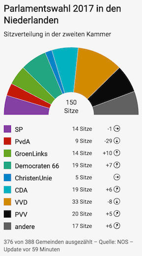

# Q Election Seats [](https://travis-ci.com/nzzdev/Q-election-seats) [](https://greenkeeper.io/)

**Maintainer**: [philipkueng](https://github.com/philipkueng)

Q Election Seats is one tool of the Q toolbox to display the allocation of seats according to parliamentary elections. Test it in the [playground](https://q-playground.st.nzz.ch/).

## Table of contents

- [Installation](#installation)
- [Configuration](#configuration)
- [Development](#development)
- [Testing](#testing)
- [Deployment](#deployment)
- [Functionality](#functionality)
- [License](#license)

## Installation

```bash
git clone git@github.com:nzzdev/Q-election-seats.git
cd ./Q-election-seats
nvm use
npm install
npm run build
```

[to the top](#table-of-contents)

## Configuration

No configuration is needed for this tool.

[to the top](#table-of-contents)

## Development

Start the Q dev server:

```
npx @nzz/q-cli server
```

Run the Q tool:

```
node index.js
```

[to the top](#table-of-contents)

## Testing

The testing framework used in this repository is [Code](https://github.com/hapijs/code).

Run the tests:

```
npm run test
```

### Implementing a new test

When changing or implementing...

- A `route`, it needs to be tested in the `e2e-tests.js` file
- Something on the frontend, it needs to be tested in the `dom-tests.js` file

[to the top](#table-of-contents)

## Deployment

We provide automatically built docker images at https://hub.docker.com/r/nzzonline/q-election-seats/.
There are three options for deployment:

- use the provided images
- build your own docker images
- deploy the service using another technology

### Use the provided docker images

1. Deploy `nzzonline/q-election-seats` to a docker environment
2. Set the ENV variables as described in the [configuration section](#configuration)

[to the top](#table-of-contents)

## Functionality

The tool structure follows the general structure of each Q tool. Further information can be found in [Q server documentation - Developing tools](https://nzzdev.github.io/Q-server/developing-tools.html).

Here is what the tool looks like on mobile and other devices. The example shows the intermediate seat allocation of the elections in the Netherlands in 2017. It's in German because we do not have multilanguage support (yet).

Q Election Seats uses [svelte3](https://svelte.dev) to render the markup on server-side.




Each graphic has the following three sections:

- Header: contains specified title and subtitle
- Main Part: displays the seat allocation including the total amount of seats. The legend indicates the correlation of color and party as well as the gained number of seats and the trend information compared to the last elections
- Footer: contains further notes (e.g. how many municipalities already finished counting), source(s) and update information

[to the top](#table-of-contents)

### Options

#### hideUpdatedDate

This option allows to hide the update date shown in the footnote section

#### Display Options

##### hideTitle

Allows to hide the title

## License

Copyright (c) 2019 Neue Zürcher Zeitung. All rights reserved.

This software is published under the [MIT](LICENSE) license.

[to the top](#table-of-contents)
