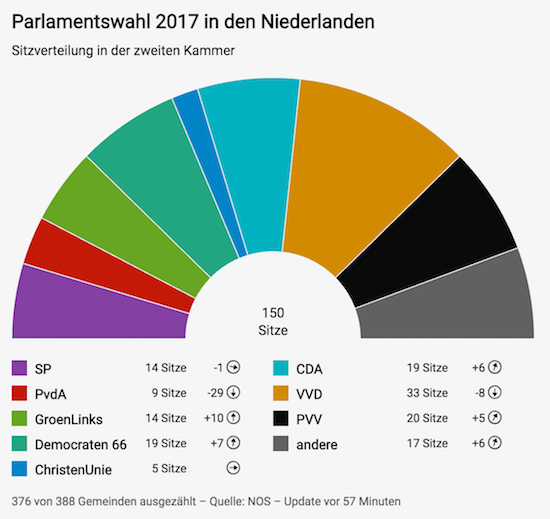

# Q Election Seats [](https://travis-ci.com/nzzdev/Q-election-seats) [](https://greenkeeper.io/)

**Maintainer**: [benib](https://github.com/benib)

Q Election Seats is one tool of the Q toolbox to display the allocation of seats according to parliamentary elections.

## Table of contents
- [Installation](#installation)
- [Development](#development)
- [Testing](#testing)
- [Tool implementation details](#tool-implementation-details)
- [Features](#features)
- [Options](#options)
- [License](#license)

## Installation

```bash
$ npm install
$ npm run build
```

[to the top](#table-of-contents)

## Development

Install the [Q cli](https://github.com/nzzdev/Q-cli) and start the Q dev server:

```
$ Q server
```

Run the Q tool:
```
$ node index.js
```

[to the top](#table-of-contents)

## Testing
The testing framework used in this repository is [Code](https://github.com/hapijs/code).

Run the tests:
```
$ npm run test
```

### Implementing a new test

When changing or implementing...
- A `route`, it needs to be tested in the `e2e-tests.js` file
- Something on the frontend, it needs to be tested in the `dom-tests.js` file

[to the top](#table-of-contents)

## Tool implementation details
The tool structure follows the general structure of each Q tool. Further information can be found in [Q server documentation - Developing tools](https://nzzdev.github.io/Q-server/developing-tools.html).

[to the top](#table-of-contents)

## Features
Here is what the tool looks like on mobile and other devices. The example shows the intermediate seat allocation of the elections in the Netherlands in 2017. It's in German because we do not have multilanguage support (yet).




Each graphic has the following three sections:
- Header: contains specified title and subtitle
- Main Part: displays the seat allocation including the total amount of seats. The legend indicates the correlation of color and party as well as the gained number of seats and the trend information compared to the last elections
- Footer: contains further notes (e.g. how many municipalities already finished counting), source(s) and update information

[to the top](#table-of-contents)

## Options

### Hide update date

This option allows to hide the update date shown in the footnote section

## License
Copyright (c) 2019 Neue Zürcher Zeitung. All rights reserved.

This software is published under the MIT license.

[to the top](#table-of-contents)
